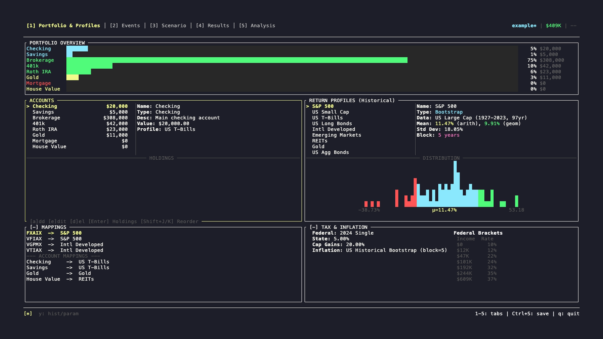

# Getting Started with FinPlan

## Navigation Basics

FinPlan is organized around **5 tabs** at the top of the screen. Switch between them using:

| Key | Action |
|-----|--------|
| `1` | Portfolio & Profiles |
| `2` | Events |
| `3` | Scenario |
| `4` | Results |
| `5` | Analysis |

Or use `Tab` / `Shift+Tab` to move between tabs and panels.

### Movement Keys

FinPlan uses **vim-style navigation by default**, but arrow keys work too:

| Key | Action |
|-----|--------|
| `j` or `↓` | Move down |
| `k` or `↑` | Move up |
| `h` or `←` | Move left |
| `l` or `→` | Move right |
| `Tab` | Next panel |
| `Shift+Tab` | Previous panel |

### Common Actions

These work in most screens:

| Key | Action |
|-----|--------|
| `a` | Add new item |
| `e` | Edit selected item |
| `d` | Delete selected item |
| `Enter` | Confirm/Select |
| `Esc` | Cancel/Close modal |
| `Ctrl+S` | Save |
| `q` | Quit |

## Your First Scenario

### Step 1: Load an Example

1. Press `3` to go to the **Scenario** tab
2. Press `i` (import) to load a file
3. Enter `/examples/example.yaml` (the bundled example)
4. You'll see a sample retirement plan with realistic data

### Step 2: Understand Your Starting Data

The example includes:
- **Accounts**: Checking, Roth IRA, Traditional 401k, Brokerage
- **Assets**: Diversified holdings in each account
- **Events**: Salary, annual expenses, Social Security at age 62
- **Parameters**: Start age (45), duration (40 years)

### Step 3: Run a Simulation

1. In the **Scenario** tab, press `r` to run a **single deterministic simulation**
   - This uses median market returns
   - Runs quickly (~1 second)
   - Great for quick testing

2. To run **Monte Carlo** (randomized market scenarios), press `m`
   - Runs 1000+ simulations
   - Shows probabilities and ranges
   - Takes 30-60 seconds
   - Most realistic for retirement planning

### Step 4: Review Results

1. Press `4` to go to the **Results** tab
2. You'll see:
   - **Net Worth Chart**: Your projected wealth over time
   - **Account Breakdown**: How much in each account type
   - **Ledger**: Detailed year-by-year transactions
   - **Percentiles**: In Monte Carlo mode, you see P5/P50/P95 scenarios

## What the App Looks Like

Here's an overview of the interface (Portfolio & Profiles tab):

**Layout Features:**
- **Tab bar** at top (numbered 1-5)
- **Main content area** (changes per tab)
- **Status bar** at bottom showing available commands
- **Panels** within each tab (navigate with Tab/Shift+Tab)
- **Lists** within panels (navigate with j/k or arrows)

## Customizing Your Scenario

### Portfolio & Profiles Tab (Tab 1)

This is where you define your accounts and assets.

**Left Panel - Accounts:**
- `a` to add a new account
- `e` to edit selected account
- `d` to delete
- Shows your current net worth and account breakdown

**Right Panels:**
- **Asset Mappings**: Link stocks (VFIAX, VTI) to market indices (S&P 500, Total Market)
- **Tax & Inflation**: Set federal tax brackets, inflation rate, state taxes

### Events Tab (Tab 2)

Define life events (income, expenses, asset purchases, etc.).

- `a` to add an event
- `e` to edit
- `d` to delete
- `t` to toggle an event on/off without deleting
- `f` to configure event effects (what actually happens)

Events have:
- **Trigger**: When it happens (age, date, or balance threshold)
- **Effects**: What happens (transfer money, buy asset, etc.)
- **Frequency**: One-time, yearly, or custom repeating

### Scenario Tab (Tab 3)

Configure the overall simulation parameters.

**Left Panel - Scenario List:**
- `n` to create a new scenario
- `c` to copy current scenario
- `s` to save with a new name
- `l` to load a scenario
- Press `Enter` to switch to selected scenario

**Right Panel - Simulation Parameters:**
- `e` to edit parameters (birth date, start date, duration, etc.)

## Common Workflows

### Creating Your Own Scenario from Scratch

1. Go to **Scenario** tab (press `3`)
2. Press `n` to create a new scenario
3. Give it a name (e.g., "My Retirement Plan")
4. Go to **Portfolio & Profiles** (press `1`)
5. Add your accounts with `a`:
   - Checking account (for living expenses)
   - 401k (tax-deferred)
   - Roth IRA (tax-free)
   - Brokerage (taxable)
6. Add your asset holdings to each account
7. Go to **Events** (press `2`)
8. Add your expected income and expenses
9. Go back to **Scenario** tab and press `r` to test your setup
10. Go to **Results** (press `4`) to see projections

### Testing "What-If" Scenarios

1. Go to **Scenario** tab, copy your current scenario with `c`
2. Give it a new name (e.g., "Retire at 60")
3. Edit the scenario parameters with `e`
4. Change relevant fields (retirement age, duration, contribution amounts)
5. Run with `r` or `m` for Monte Carlo
6. Compare results

### Adjusting for Different Market Conditions

1. Go to **Portfolio & Profiles** tab
2. In the **Asset Mappings** panel, select a ticker (e.g., VFIAX for S&P 500)
3. Press `m` (map) to assign it to a return profile
4. You can choose from historical presets or create custom return distributions

## Understanding the Display

### Net Worth Chart

The bar chart at the top of **Results** tab shows your projected net worth over time:

- **Height of bars** = Total net worth that year
- **Highlighted bar** = Year you're currently viewing
- Use `h/l` or arrow keys to navigate years

### Monte Carlo vs Single Run

- **Single Run**: One line, uses median returns (50th percentile)
- **Monte Carlo**: Shows probability distribution:
  - **P5 (5th percentile)**: Worst 5% of scenarios
  - **P50 (50th percentile)**: Median, middle outcome
  - **P95 (95th percentile)**: Best 5% of scenarios
  
Press `v` in Results to cycle between percentiles.

### Color Codes

- **Green**: Investment accounts (Brokerage, 401k, all IRAs)
- **Cyan**: Cash accounts (Checking, Savings, HSA)
- **Yellow**: Property and collectibles
- **Red**: Debt and liabilities

## Tips for Success

### Build Realistic Scenarios

1. **Start with current numbers**: Use actual account balances, not estimates
2. **List all income sources**: Salary, bonuses, RSU vesting, Social Security
3. **Include all expenses**: Housing, food, medical, insurance, gifts
4. **Account for taxes**: Set your actual federal bracket, state taxes
5. **Model major life events**: Career changes, inheritance, large purchases

### Test Different Assumptions

1. Create variations of your main scenario:
   - Conservative (lower returns, higher expenses)
   - Realistic (historical average returns)
   - Optimistic (higher returns, lower expenses)

2. Run Monte Carlo on each to see probability ranges

3. Use the **Analysis** tab to test sensitivity (see [Understanding Results](05-results-interpretation.md))

### Keep Scenarios Organized

- Use clear names: "Retire at 62 - Conservative"
- Save regularly with `Ctrl+S`
- Back up by exporting scenarios with `x`
- Copy scenarios before making major changes with `c`

## Next Steps

- Read [Tab Reference](02-tabs-guide.md) for detailed information on each tab
- Learn [How to Manage Scenarios](03-scenarios.md)
- Understand [Simulation Types](04-simulations.md)
- Master [Results Interpretation](05-results-interpretation.md)
- Reference [Keybindings](06-keybindings.md) anytime
