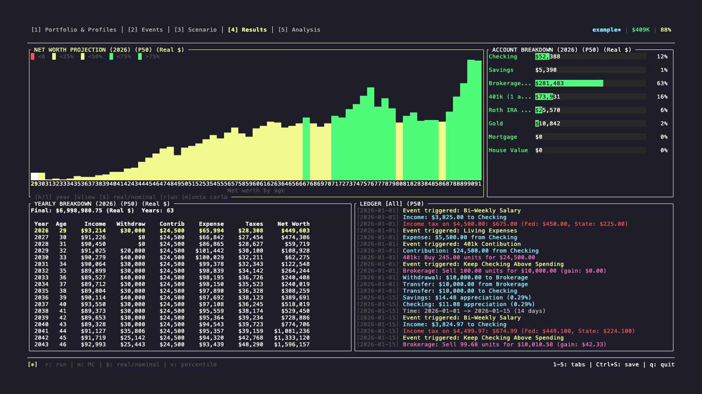
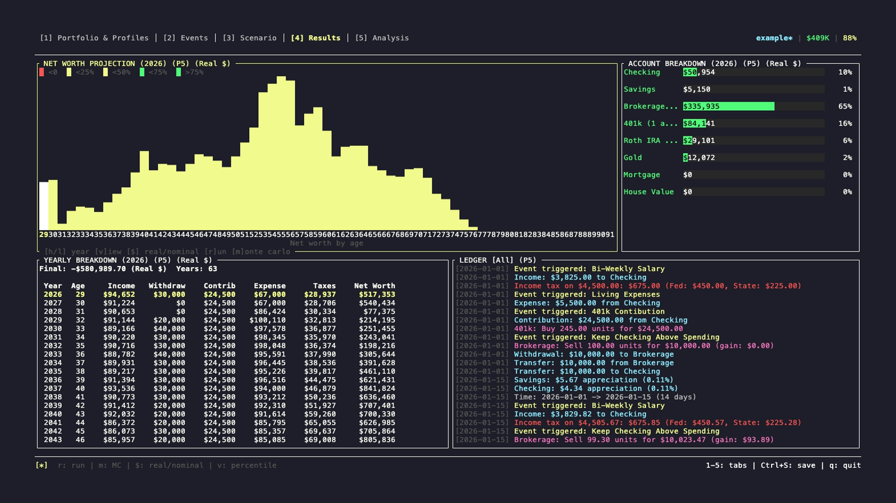
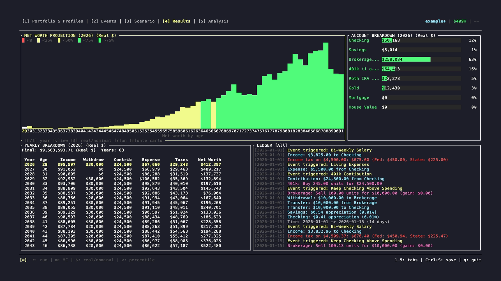
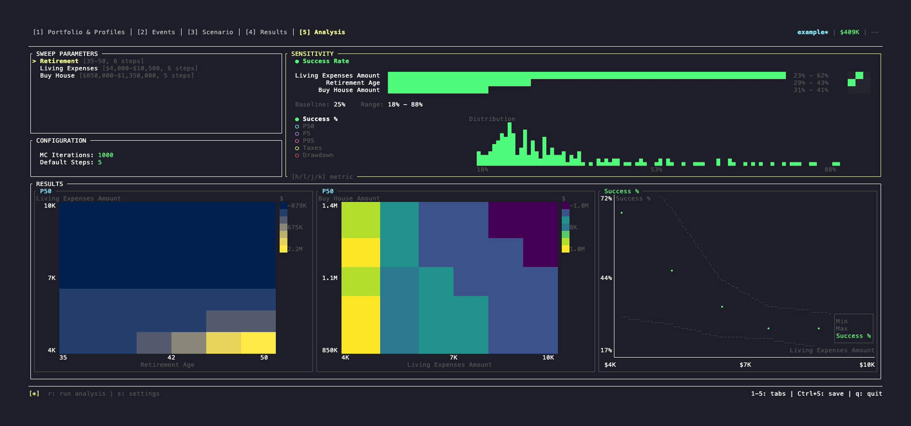
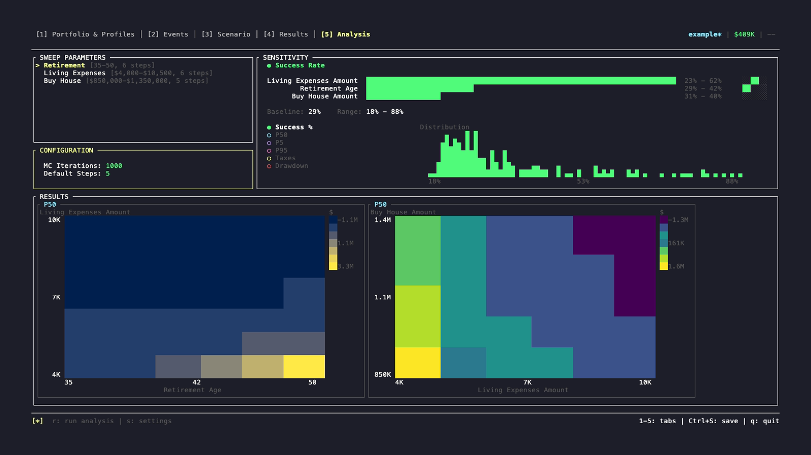

# Understanding Results & Analysis

WARNING: This was generated by AI.  Some of it does not match with the screenshots.  Some does not make sense. Working to improve this in the future.

This guide explains how to interpret what FinPlan shows you in the **Results** tab (Tab 4) and the **Analysis** tab (Tab 5). For navigation and keybindings in these tabs, see [Tab Reference](02-tabs-guide.md).

---

## Tab 4: Results

The Results tab has four panels:

1. **Net Worth Chart** (top-left) — your wealth over time as a bar chart
2. **Account Breakdown** (top-right) — wealth split by account type
3. **Ledger** (bottom) — year-by-year transaction detail
4. **Status Bar** (bottom edge) — key metrics at a glance

### Net Worth Chart

Each bar represents one year. Bar height = total net worth. Bars are stacked by account type:

| Color | Account Types |
|-------|--------------|
| Green | Investment accounts (Brokerage, 401k, all IRAs) |
| Cyan | Cash (Checking, Savings, HSA) |
| Yellow | Property and collectibles |
| Red | Debt (negative, reduces total height) |

**Percentile views (Monte Carlo only):** Press `v` to cycle through P5, P50, P95, and Mean. Only one percentile is shown at a time — the chart title shows which one (e.g., `P50 Nominal`).

**Nominal vs Real dollars:** Press `$` to toggle. Nominal shows raw numbers; Real adjusts for inflation so all years are in today's dollars. A $1M bar in 2045 Real dollars is worth more than a $1M bar in 2045 Nominal.

#### Chart Shape Patterns

Different plan outcomes produce recognizable chart shapes:

**Steady Decline — expected and healthy:** Spending down savings at a planned rate.

**Cliff — plan fails:** Money runs out suddenly. Check the P5 view — if it shows a cliff, your plan is at risk.

**Plateau — excellent:** Income covers expenses; wealth is self-sustaining.

**Growth — over-saved:** Wealth keeps growing in retirement — you may be able to spend more or retire earlier.

The screenshots below show P50 (median outcome) and P5 (worst-5% outcome) for the same scenario:





### Account Breakdown Panel

Shows the current selected year's wealth split by category. What to look for at each life stage:

**Early Retirement (Age 60–65):**
- 2–3 years of expenses in cash (cyan) as a spending buffer
- Mix of tax-deferred (401k/IRA) and tax-free (Roth) for flexibility
- Some taxable brokerage for flexible withdrawals

**Mid-Retirement (Age 75–85):**
- 1–2 years of expenses in cash
- Tax-deferred declining (drawing it down via RMDs)
- Tax-free (Roth) preserved as long as possible

**Late Retirement (Age 90+):**
- Portfolio mostly spent down — this is normal
- Some Roth may remain (it never has RMDs)
- Debt should be zero

**Red flags:**
- All cash — no growth, inflation erodes purchasing power
- Single account type — no tax flexibility for withdrawals
- Red (debt) growing over time — liabilities increasing
- Bars reaching zero — plan has failed in this scenario

### Ledger Panel

Year-by-year breakdown. Navigate with `j/k` or arrow keys.



**Ending Balance formula:** `Start + Income − Expenses − Taxes + Returns`

**Column meanings:**

| Column | What it shows |
|--------|--------------|
| Income | All money in — salary, Social Security, transfers received |
| Expenses | Living costs and planned purchases |
| Taxes | Federal and state income taxes paid that year |
| Returns | Market gains/losses. In a single run, always the median return. In Monte Carlo, varies by run and is shown for the selected percentile. |
| End Bal | Net worth at end of year |

**What to look for:**
- **Money hitting zero or going negative** — plan fails that year
- **Large tax years** — often Roth conversion years or high-income years; flag for tax planning
- **Sudden income drop** — should match your retirement event date
- **Returns going negative** — market crash years in that percentile's scenario

### Status Bar

The status bar at the bottom of the Results tab shows:

- **Success Rate** — percentage of Monte Carlo runs where money lasted the full simulation period. Only shown after a Monte Carlo run.
- **P5 / P50 / P95** — final net worth at the 5th, 50th, and 95th percentile across all runs
- **Max Drawdown** — the worst single-year percentage decline in net worth across the simulation. A drawdown of −35% means net worth fell 35% from one year to the next in the worst year.
- **Display Mode** — which percentile is currently shown in the chart (P5, P50, P95, or Mean) and whether dollars are Nominal or Real

### Interpreting Monte Carlo Results

#### Success Rate

The most important single number. It answers: "In what fraction of simulated futures does my plan work?"

```
1000 simulations run with different random market returns:

Succeeded: 920 (92% success rate)
Failed:      80 (8% failure rate)
```

| Range | Meaning | Guidance |
|-------|---------|---------|
| 95%+ | Very safe | Retire confidently |
| 90–95% | Good | Safe for most plans |
| 80–90% | Moderate risk | Acceptable if you have spending flexibility |
| 70–80% | High risk | Plan likely needs adjustment |
| <70% | Very risky | Modify before relying on this plan |

**Rules of thumb:**
- 30-year retirement: aim for 90%+
- 40+ year retirement: aim for 95%+
- If you can cut spending or work part-time in a downturn: 80%+ may be acceptable

#### Percentile Outcomes

Four views of final net worth across all runs:

**P5 — worst 5%:**
The bottom 5% of outcomes. Think of this as "bad luck scenario." If this is positive, your plan has a cushion even in bad markets.

**P50 — median:**
Half of runs end above this, half below. This is your most likely outcome. Plan your lifestyle around this.

**P95 — best 5%:**
The top 5% of outcomes — excellent market timing. Don't plan around this; it's the upside.

**Mean — average:**
Mathematically averages all 1000 runs. Often pulled above P50 by a few very good outcomes. Less useful for planning than P50.

#### Example: Good Plan vs Concerning Plan

```
Good Plan:
  Success: 92%    P5: $200K    P50: $800K    P95: $2.2M
  → Even worst-case has cushion. Median is strong.

Concerning Plan:
  Success: 72%    P5: −$50K    P50: $300K    P95: $1.5M
  → 28% chance of failure. Worst case runs out of money.
```

---

## Tab 5: Analysis

The Analysis tab runs a **parameter sweep** — it tests your scenario across a range of values for one or two parameters and shows how outcomes change. This answers questions like "how does retiring at 60 vs 70 change my success rate?"

For how to configure and run sweeps, see [Tab Reference](02-tabs-guide.md#tab-5-analysis). This section covers how to read the results.

### Reading a 1D Scatter Plot

Used when sweeping one parameter. The X-axis is the parameter value; the Y-axis is your chosen metric (usually success rate).




**How to use it:** Find the point where success rate crosses your target (e.g., 90%) and read down to the X-axis. That's your answer. In this example: retire at 64 for 90% confidence.

### Reading a 2D Heatmap

Used when sweeping two parameters simultaneously. Color shows the outcome — green is good, red is risky.




The top-left corner (early retirement + high spending) is always the riskiest. The bottom-right (late retirement + low spending) is always the safest. You're looking for the boundary where color shifts from green to yellow — that's the edge of your comfort zone.

**Example reading:** "I want to retire at 62. How much can I spend?" — scan the column at age 62 and find the spending level where the cell turns green. In the example above: $60K/year is safe at 62; $80K is moderate risk.

### Available Metrics

You can change what the chart measures with `t` (toggle metric):

| Metric | Use it to answer |
|--------|-----------------|
| **Success Rate** | Will my plan work? |
| **P50 Final Net Worth** | What's my most likely ending wealth? |
| **P5 Final Net Worth** | What does my worst-case look like? |
| **P95 Final Net Worth** | What's my upside? |
| **Lifetime Taxes** | Which strategy costs least in taxes? |
| **Max Drawdown** | How bad could a single down year get? |

### Common Decision Questions

**"When can I retire?"**
1. Add your retirement event's trigger age as a sweep parameter (e.g., 60–70)
2. Run with `r`
3. In the 1D chart, find where success rate crosses 90%
4. That age is your safe retirement target

**"How much can I spend?"**
1. Add annual spending as a sweep parameter (e.g., $40K–$120K)
2. Run with `r`
3. Find the maximum spending that keeps success rate above your threshold
4. That's your safe spending ceiling

**"Should I delay Social Security?"**
1. Create two scenarios: one claiming at 62, one at 70
2. Run Monte Carlo on each in the Scenario tab
3. Compare their success rates in Results
4. Waiting typically wins, but the margin depends on your longevity assumptions

**"What's my safe withdrawal rate?"**
1. Add your withdrawal amount (or percentage) as a sweep parameter
2. Test 2%–6%
3. Find the highest rate that keeps success rate above 90%
4. That's your personal safe withdrawal rate — it will differ from the generic "4% rule" based on your specific account mix and timeline

---

## Quick Reference: What Good Looks Like

| Indicator | Healthy | Concerning |
|-----------|---------|-----------|
| Success rate | 90%+ | Below 80% |
| P5 final net worth | Positive | Zero or negative |
| P50 final net worth | Supports your lifestyle | Uncomfortably low |
| Chart shape | Gradual decline or plateau | Cliff or sudden drop |
| Account mix | Mix of tax types | All in one account |
| Ledger taxes | Declining in retirement | Unusually high or spiking |

## When to Adjust Your Plan

- **Success rate < 85%**: Plan is risky — consider changes
- **P5 outcome is negative**: Even moderate bad luck could fail your plan
- **Chart shows a cliff**: Money runs out at a specific year — check the ledger for that year

**Levers to pull:**

| Change | Typical effect |
|--------|---------------|
| Reduce annual spending 10% | +5–10% success rate |
| Work one additional year | +3–5% success rate |
| Delay Social Security to 70 | +3–7% success rate |
| Add Roth conversions in early retirement | −1–2% success rate near-term, +2–4% long-term |
| More conservative asset allocation | Lower returns AND lower volatility — mixed effect |

---

**Next:** See [Keybindings Reference](06-keybindings.md) for complete keyboard shortcut reference.
